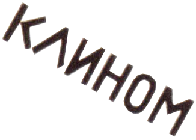
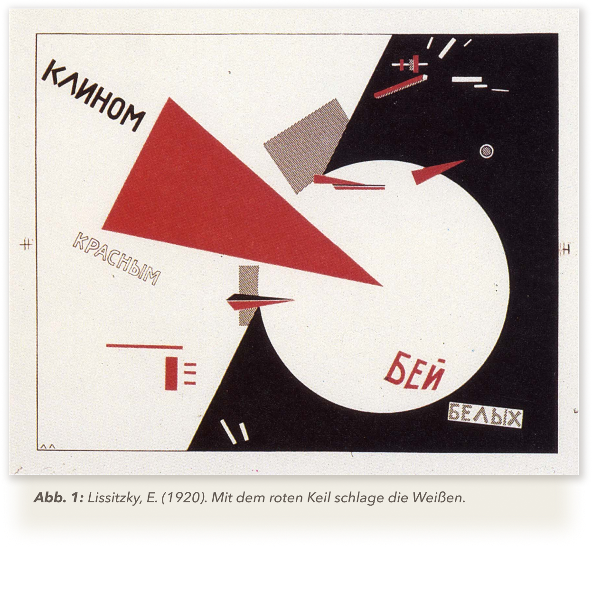
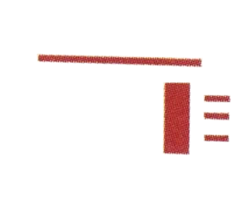
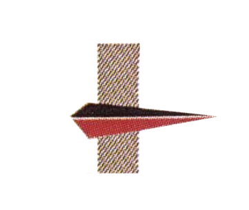
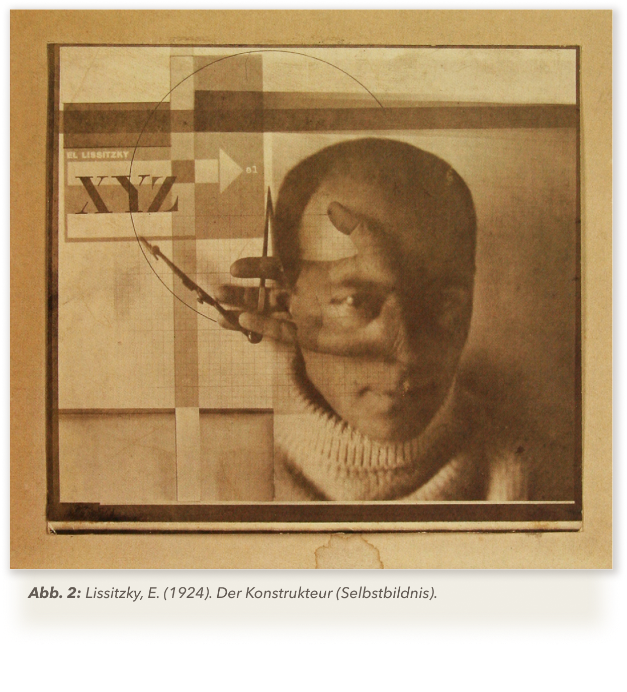
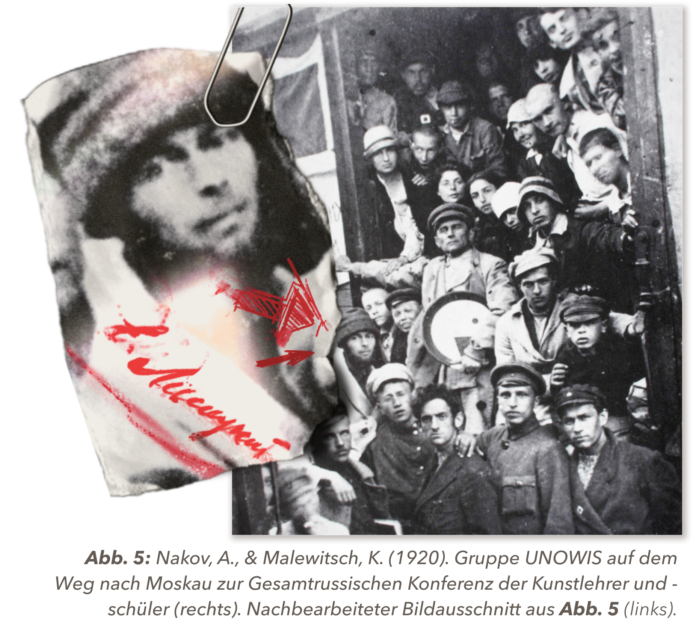
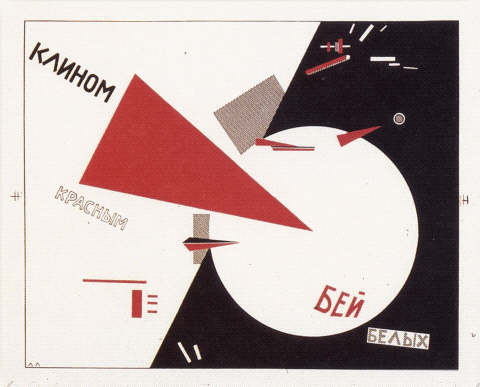
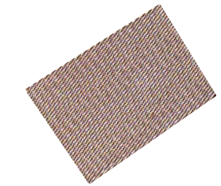
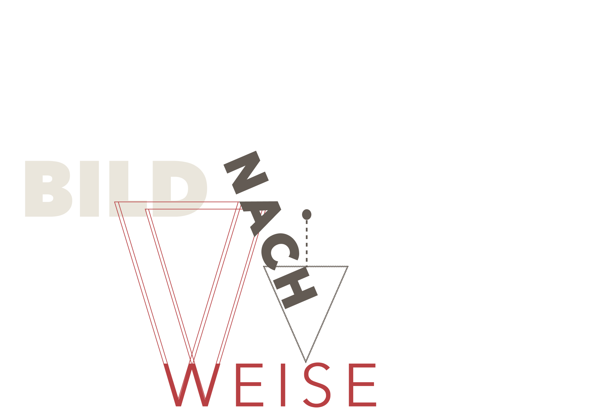

# »Mit dem roten Keil schlage die Weißen«

Das Plakat „Mit dem roten Keil schlage die Weißen“ (Original auf russisch: „Клином красным бей белых“) von El Lissitzky aus dem Jahr 1920 ist ein Propagandaplakat für die rote Armee zu Zeiten der politischen Umstrukturierung und des Bürgerkriegs in Russland nach der Oktoberrevolution. Es entstand in Witebsk, damals Russland – heute Weißrussland – und hat dessen Titel von dem Schriftzug, welcher sich auf dem Plakat befindet, übernommen.

### Leitfaden
Der Leitfaden meiner Narration ist der Aufsatz von Prof. Dr. Verena Krieger 
„El Lissitzkys "Roter Keil" - 4 Kontexte und 3 Bildlektüren.  Die Semantik der Form in Ikonologischer Perspektive“ (2015). [&lbrack;1&rbrack;](#quellen) 

Darin stellt sie zu Beginn die Ausgangsfrage in den Raum, warum dieses Werk von der Kunsthistorik so wenig erforscht sei und zeigt mit ihrer Narration die Vielseitigkeit und Komplexität dieses Werks auf.

 Ich baue meine Auseinandersetzung prinzipiell auf ihre Argumentation auf, während sie jedoch versucht, die Komplexität des Plakats zu belegen, nehme ich in meiner Narration diesen Fakt bereits als gegeben an und beschäftige mich stattdessen mit der Frage nach der Dualität des „Roten Keils“, welche sich durch die verschiedenen Deutungen wie ein roter Faden durchzieht.

Was damit gemeint ist, erkläre ich im Folgenden.

---

## Dualität von Krieg & Kunst

„Mit dem roten Keil schlage die Weißen“ stellt auf vielen Ebenen einen Zustand der Ambivalenz dar!

Ob in der Komposition, welche sich konsequent in Form, Farbe und Kontrast einer Zweiteilung bedient, oder in der Darstellung der polarisierten Bevölkerung im Bürgerkrieg, welche sich lediglich als eine fragmentierte Gesellschaft zwischen den Fronten begegnet. 

### Ausgangsfrage
Wie es die Ironie so will, ist auch das Werk selber genau in der Position gelandet, die es abbildet, nämlich in einem Zustand der Zerrissenheit, jedoch in einem anderen Kontext, als man vielleicht annehmen mag. 

Gemeint ist der kunsthistorische Diskurs um das Werk, oder besser gesagt, der Mangel an diesem. Obwohl sich der „Rote Keil“, sowohl in der Erforschung politischer Plakatkunst, als auch im kunsthistorischen Raum, einer durchaus großen Bekanntheit erfreut, sieht sich keine dieser Disziplinen für die Erforschung dieses Plakats zuständig. 

So scheint die Propagandaforschung das Fehlen einer gegenständlichen Ikonographie, was sich im politischen Plakat nicht durchgesetzt hatte, als Ausschlusskriterium für einen potentiellen Forschungswert anzusehen, während die Kunsthistorik die offensichtliche Lesbarkeit der Aussage als Qualitätsmangel im künstlerischen Wert belächelt. Währenddessen findet sich der „Rote Keil“ erneut im Zentrum des Konflikts ein, bei welchem von beiden Parteien leider mal wieder nur in schwarz-weiß gedacht wird.

Dabei ist gerade das Zusammenwirken von Abstraktion und Kommunikation – Propagandaplakat und Kunstwerk – so spannend in der Fragestellung nach der Semantik der gegenstandslosen Formsprache und der Erforschung diverser kultureller und wahrnehmungspsychologischer Einflüsse.

### Mein roter Faden
Ich stellte mir die Frage, ob sich neben dem Offensichtlichen auch andere Formen der Dualität in den Deutungen finden lassen, was im Folgenden auch zum zentralen Punkt meiner Auseinandersetzung wird.

---

# Kultureller Kontext
Bevor ich in die tatsächliche Bildanalyse gehe, ist es wichtig, einen grundlegenden historischen, politischen und künstlerischen Kontext zu etablieren, sowohl zur russischen Gesellschaft zur damaligen Zeit, als auch zu Lissitzky und seinem Werk, um später die Zusammenhänge in den Deutungen besser nachzuvollziehen. 

 

### Russische Bevölkerung verstehen
Keine Kultur existiert ohne ihre Bevölkerung. Um die Kohärenz hinter den Propagandainstrumenten als Gesamtbild zu verstehen, muss man die russische Mentalität und ihren gesellschaftlichen Kontext zumindest in Grundzügen verstehen. 

### Russland im Krieg
Angefangen bei dem zeitgenössischen Bürgerkrieg, welcher die Gesellschaft stark fragmentiert hatte, wodurch die Menschen besonders anfällig für eine Radikalisierung durch Propaganda waren. 

### Christlich-orthodoxe Prägung
Jedoch waren zuvor schon starke Einflüsse aus der orthodox-christlichen Kirche tief in der Mentalität Russlands verankert, wodurch ihnen eine fast schon metaphysische Symbolik aus dem Ikonenkult durchaus vertraut war. Das bedeutet, dass die Menschen bereits eine Bildsprache in ihrer Kultur praktiziert hatten, wodurch das Bild als solches in der Bevölkerung einen besonderen Stellenwert einnahm.

### Analphabetische Bevölkerung
Der entscheidende Faktor war jedoch vermutlich, dass der Großteil der Bevölkerung analphabetisch und dementsprechend bereits auf eine Symbolsprache in der nicht-verbalen Kommunikation angewiesen war, nachdem der Bildungsstand der Mehrheitsbevölkerung nach dem ersten Weltkrieg eher niedrig war. Dies wurde selbstverständlich von der Propaganda aufgegriffen, welche enorme Wirkung darin zeigte, das Volk in die politisch-militärische Positionierung zu locken und miteinzubeziehen.

---

## Wer war El Lissitzky?

---

## Suprematismus

---

## Gegenstandslosigkeit

---

# Formsemantische Analyse
Für die Formsemantische Analyse werde ich zunächst mit der vor-ikonographischen Beschreibung anfangen und dann in eine Deutung übergehen.

Das Plakat hat einen zum Bildformat proportionalen Rahmen, welcher aus einer schwarzen, dünnen, durchgezogenen Linie besteht. Innerhalb des Rahmens wird die Fläche durch eine Diagonale, welche in einem Winkel von ca. 120° verläuft, rechts in eine helle und links in eine dunkle Seite aufgeteilt. Die helle Seite ist weiß, die dunkle schwarz. Auf der schwarzen Seite sieht man einen kreisförmigen Ausschnitt, welcher vom Durchmesser her ca. die Hälfte der Höhe des Plakats hat und sich im unteren, rechten Quadranten innerhalb des Rahmens befindet. Der Kreis wird von der Diagonale an zwei Punkten geschnitten.   

Leichte nach links versetzt im Zentrum befindet sich ein rotes, gleichschenkliges Dreieck, welches von der Länge her etwas größer ist, als der Durchmesser des Kreises. Die Spitze des Dreiecks überlappt sich mit dem Kreis und endet ungefähr in der Mitte von diesem. Weitere, kleinere, rote Dreiecke befinden sich rechts, oberhalb des großen Dreiecks. Mittig, unterhalb des großen Dreiecks befindet sich eine Raute, die sich aus zwei symmetrischen Dreiecken zusammensetzt, wobei das obere schwarz und das untere rot ist. Alle Dreiecke zeigen nach links.

Mittig unter, sowie rechts über dem großen Dreieck befinden sich jeweils zwei Vierecke, die in einem schwarzen Punktraster gefüllt sind. Das untere, kleine Viereck wird dabei von der Raute mittig gekreuzt und steht von der Rotation her parallel zum Plakat. Es befindet sich genau links von der vertikalen Mittellinie. Das obere, große Viereck schneidet mit der rechten, oberen Ecke die schwatze Fläche und ist um ca. 45° gekippt. Es befindet sich genau rechts von der Mittellinie.

Innerhalb der schwarzen Fläche sind jeweils unter und über dem großen Kreis kleine, schmale Vierecke verteilt, welche wie kleine, dicke Linien aussehen und weiß sind. In der linken, unteren Ecke der schwarzen Fläche befinden sich zwei Linien, die diagonal, aber nicht parallel zueinander angeordnet sind. In der rechten, oberen Ecke sind sechs Linien, von denen drei ebenfalls diagonal und nicht parallel zueinander sind, sowie drei horizontale Linien, welche sowohl parallel zueinander, als auch zum Plakat sind. Außerdem befindet sich in dieser Ecke ein Quader, dessen Dreidimensionalität mithilfe einer Schattierung mit einem schwarzen Punktraster angedeutet ist und eine weitere Anordnung an Linien, welche jedoch abwechselnd beige, rot, oder mit dem schwarzen Punktraster eingefärbt sind. Diese Anordnung besteht aus horizontalen und vertikalen Linien, die alle im 90° Winkel zueinander stehen. Als einziges rundes Element in dieser Ecke ist ein kleiner, heller Kreis, auf den eins der kleineren, roten Dreiecke direkt zeigt.

Auf der weißen Seite des Plakats befinden sich vier rote Vierecke, die ebenfalls wie kleine Linien aussehen, sowie ein breiteres, ebenfalls rotes Viereck. Die Linien sind horizontal, das Viereck vertikal ausgerichtet. Es gibt drei kurze und eine Längere Linie. Die Linien und das Viereck stehen alle im 90° Winkel zueinander. Unter der langen, roten Linie befindet sich eine Art Verbindungslinie, welche eine Ecke der roten Linie, mit der anderen verbindet. Diese ist schwarz, dünn und durchgezogen.

Auf dem gesamten Plakat sind insgesamt vier typografische Elemente verteilt, jeweils zwei auf der rechten und linken Seite, welche gemeinsam den Schriftzug "Клином красным бей белых" bilden (Russisch für "Mit dem roten Keil schlage die Weißen"). Alle Wörter sind in Druckschrift und Versalien geschrieben. Das Wort "Клином" steht links oben in schwarz, "красным" steht unter der horizontalen Mittellinie, etwas nach rechts vom ersten Wort versetzt, schwarz umrandet, ohne Füllfarbe, "бей" steht rechts unten im großen Kreis und ist in Rot geschrieben und schlussendlich steht das Wort "белых" innerhalb der schwarzen Fläche, rechts in der Ecke des Plakats, innerhalb eines viereckigen, weißen Kästchens und die Buchstaben sind mit dem schwarzen Punktraster gefüllt. Alle Wörter sind um ca. -30° gekippt, bis auf "белых", welches um ca. -10° gekippt wurde.

Grundsätzlich hat das Plakat drei Farben, nämlich schwarz, weiß und rot, wobei es sich bei weiß um die Papier- bzw. Hintergrundfarbe handelt.

---

## Deutung im Kontext des Bürgerkriegs
Um bei den Farben zu bleiben, schauen wir uns zunächst die farblich zugeordnete Rollenverteilung an. Dabei sind „die Roten“ die Hauptakteure, mit dem roten Keil als Protagonisten, während „die Weißen“ die gegnerischen Truppen darstellen. Schwarz wäre in diesem Kontext erstmal nur das Terrain. Gleichzeitig kennzeichnen schwarz und weiß die beiden gegnerischen Fronten, welche im Kontrast zueinander gegenübergestellt werden, zwischen denen sich der rote Keil bewegt. 

Es wird ein Bild von zwei grundsätzlichen Gegensätzen mit einer hellen, dominanten und einer dunklen, unterlegenen Seite gezeichnet, was durch die optisch größer wirkenden weißen Fläche unterstrichen wird.
Betrachtet man den Kreis als eine Negativform, anstatt einer weißen Fläche, kann man diesen als einen Leerraum interpretieren, in welchen der rote Keil ohne Widerstand eindringen kann. 

Auch bei Betrachtung der beiden dominanten Diagonalen erkennt man eine Darstellung von einem Machtverhältnis: Die erste Diagonale sei der Verlauf des roten Keils, dessen Spitze direkt auf das Zentrum des Kreises zeigt, wie bei einer Zielscheibe, die von einem Pfeil direkt ins Schwarze getroffen wurde, die zweite sei die Grenze der feindlichen Terrains, welche von dem roten Keil ohne Weiteres bereits überschritten wurde.

Ähnliche Dynamiken zeigen sich auch in der Komposition der einzelnen Formelemente: Die Roten zeigen zielgerichtet auf den Gegner, während due Weißen nicht nur klein, sondern auch etwas zerstreut und defensiv an den Rand gedrängt werden. Auch die typographischen Elemente folgen dem gleichen Schema, bei welchem die Wörter „Mit dem roten Keil schlage“ die Dynamik und Bewegungsrichtung des roten Keils unterstützen und das Wort „die Weißen“ nicht nur in die Ecke, sondern dieses gänzlich aus dem weißen Kreiß verdrängen.

---

## Dualität der feindlichen Fronten

Aus einer reinen formsemantischen Deutung heraus kann man das Motiv als ein antithetisches Kampfbild bezeichnen, welches von einem Gut und Böse, einem Richtig und Falsch, einem Wir und die Anderen ausgeht, da ohne Zweifel eine eindeutige Darstellung des militärischen Konflikts zwischen den Weißen und den Roten abgebildet wird, welche ein Machtverhältnis der gegensätzlichen Fronten illustriert und dabei die Dominanz der Roten klar etabliert. 

Auch in der Komposition, sowie Farb- und Formsprache wird eine klare Gegenüberstellung feindlicher Terrains ersichtlich, zwischen denen sich der Rote Keil als Protagonist und Hauptakteur bewegt.

Doch steckt hinter dem „Roten Keil“ tatsächlich nur eine propagandistische Kampfansage, oder lässt sich eine tiefere Komplexität ergründen, die auf den ersten Blick nicht gleich ersichtlich ist?

---

## Visuelle Sprache

---

## Dualität von Tradition & Innovation

---

# Wahrnehmungspsychologische Analyse

---

## Dualität von Kampf & Sieg

---

## Fazit

---

## Quellen

Scrollen für Literaturverzeichnis und Bildnachweise!
 
 
[Hier klicken](#start), um zum Anfang zu springen!

### Credits
Text & Gestaltung: **Maria Dinitz**  
Betreuung: **Dr. Sabine de Günther**  
Kurs: **Argumentation im Bild und über das Bild: Europäische Bild- und Kleidergeschichte visualisiert**   
Sommersemester 2024  
Fachhochschule Potsdam  

---

 
 

[Contact](mailto:marian.doerk@fh-potsdam.de,philipp.proff@gmx.de?subject=Syllabus%20Site) · [Imprint](https://www.fh-potsdam.de/impressum) · *This is a [Syllabus Site](https://infovis.fh-potsdam.de/syllabus-site/)*
